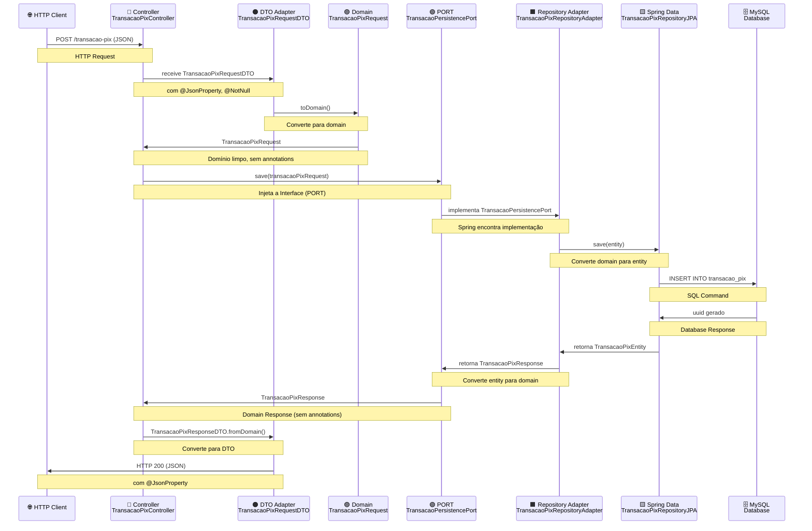

# lab-a01-app-repository-payment

Projeto de estudo da simula pagamentos com Spring Cloud

---


---

## 🚀 Começando

Esse projeto é um exemplo de laboratório que simula operações de pagamentos via PIX. É uma API com um CRUD e utiliza 
[Spring Data JPA](https://spring.io/projects/spring-data-jpa) como ferramenta para fazer operações em um banco de dados 
MySql. E como recurso temos o [Flyway](https://www.red-gate.com/products/flyway/community/) como ferramenta para 
versionamento de tabelas de banco de dados mysql. E para complementar essa API trabalha com Spring Cloud e está se 
regisrando em um [Service Registration and Discovery](https://spring.io/guides/gs/service-registration-and-discovery)
como o Eureka.


### 📋 Pré-requisitos

Instale alugmas ferramentas como

* Java 17
* Maven
* Docker
* Spring Cloud Eureka

### 🔧 Instalação

Instale o Java 17. Utilizei o [SDKMAN](https://sdkman.io/) como ferramenta no linux:
```bash
  sudo sdk install java 17.0.13-zulu
```

Instale o Maven. Utilizei o [SDKMAN](https://sdkman.io/) como ferramenta no linux:
```bash
  sudo sdk install maven 3.8.5
```
Instale o Docker. Instelei o docker via [SNAP](https://snapcraft.io/) no linux

```bash
  sudo snap install docker
```

Clone o projeto

```bash
  git clone https://github.com/williamreges/lab-a01-app-repository-payment.git
```

Suba um serviço de registro e descoberta Spring Cloud para que a API se registre nela. Se optar por criar um do zero
siga esse tutorial [Service Registration and Discovery](https://spring.io/guides/gs/service-registration-and-discovery).
Porém, se quiser rodar outro projeto complementar a esse projeto clone o seguinte repo e siga o que está no README.md
```bash
  git clone https://github.com/williamreges/lab-a01-infra-service-registry
```
---

## 🏗️ Arquitetura Hexagonal (Ports & Adapters)

Este projeto segue os princípios da **Arquitetura Hexagonal**, garantindo separação clara de responsabilidades e isolamento da lógica de negócio.

### 📁 Estrutura de Pastas

```
com/example/payment/
├── domain/                          ← Núcleo puro (sem frameworks)
│   ├── entity/
│   │   ├── TransacaoPixRequest
│   │   ├── TransacaoPixUpdateRequest
│   │   ├── TransacaoPixResponse
│   │   └── TransacaoPixQueryRequest
│   ├── exception/
│   │   ├── BusinessException
│   │   ├── DuplicateEntityBusinessException
│   │   ├── EntityNotFoundBusinessException
│   │   └── OperationNotAllowedBusinessException
│   ├── port/
│   │   └── TransacaoPersistencePort (interface)
│   └── valueobject/
│
├── adapter/                         ← Adapters (entrada e saída)
│   ├── input/rest/
│   │   ├── controller/
│   │   │   └── TransacaoPixController (Driving Adapter)
│   │   └── dto/
│   │       ├── TransacaoPixRequestDTO
│   │       ├── TransacaoPixUpdateRequestDTO
│   │       └── TransacaoPixResponseDTO
│   └── output/persistence/
│       └── repository/
│           └── TransacaoPixRepositoryAdapter (Driven Adapter)
│
├── application/                     ← Orquestração
│   ├── mapper/
│   ├── exception/
│   └── usecases/
│
└── infrastructure/                  ← Configuração técnica
    └── configuration/
```

### ✅ Benefícios da Arquitetura Implementada

- ✅ **Domain Limpo** - Sem dependências de frameworks Spring/Jackson
- ✅ **Ports Bem Definidas** - Interfaces no domain garantem contratos claros
- ✅ **Adapters Separados** - Entrada (HTTP) e Saída (Persistência) independentes
- ✅ **DTOs Específicos** - Annotations de serialização apenas nos DTOs, não no domain
- ✅ **Inversão de Dependências** - Controller → Port (Interface) → Adapter
- ✅ **Testabilidade** - Mock da Port sem necessidade de Spring
- ✅ **Flexibilidade** - Trocar implementação de persistência sem afetar o domain

### 🔄 Fluxo de Requisição


## ⚙️ Executando os testes

Entre no Projeto

```bash
  cd lab-a01-app-repository-payment
```

Instale as dependencies do projeto

```bash
  mvn clean install
```
Execute o docker-compose para subir um contaneiner de banco de dados [mysql](https://hub.docker.com/_/mysql)

```bash
  cd docker/
  sudo docker-compose up -d
```

Start o serviço
```bash
  mvn spring-boot:run
```
Entre na porta http://localhost:8000/actuator/health e se retornar `status: "UP"` é porque está rodando com sucesso.

Para testar uma requisição de operação de pagamento via PIX execute o curl abaixo e a resposta será um UUID.
```bash
  curl --request POST \
  --url http://localhost:8000/transacao-pix \
  --header 'Content-Type: application/json' \
  --header 'User-Agent: insomnia/10.3.0' \
  --data '{
	"codigoPessoa": "fbc5fbc7-9b55-4058-af41-fa94ae092ae8",
	"valorTrancacao": 2500.50,
	"dataTrancacao": "2025-02-03T13:00:00",
	"codigoBeneficiario": "02d807e5-dd29-4a25-9de7-a621209c28b7",
	"mensagemTransacao":" PIX para compra de carro"
}'
```
E com o UUID gerado podemos obter o registro gravado na tabela conforme exemplo abaixo:

```bash
curl --request GET \
--url http://localhost:8000/transacao-pix/8644ae90-9225-41bd-8ff6-0a4b9622bfdc \
--header 'User-Agent: insomnia/10.3.0'
```
E com isso logo será retornado algo parecido com esse body abaixo:

```json
{
  "codigoTrancacao": "8644ae90-9225-41bd-8ff6-0a4b9622bfdc",
  "codigoPessoa": "fbc5fbc7-9b55-4058-af41-fa94ae092ae8",
  "valorTrancacao": 2500.5,
  "dataTrancacao": "2025-02-03T13:00:00",
  "codigoBeneficiario": "02d807e5-dd29-4a25-9de7-a621209c28b7",
  "mensagemTransacao": " PIX para compra de carro"
}
```

## ⚙️ Gerando testes com Cucumber
```shell
mvn archetype:generate                     \
"-DarchetypeGroupId=io.cucumber"           \
"-DarchetypeArtifactId=cucumber-archetype" \
"-DarchetypeVersion=7.31.0"                \
"-DartifactId=integrationtest"               \
"-DgroupId=lab-a01-app-repository-payment"                  \
"-Dpackage=com.example.payment"                  \
"-Dversion=1.0.0-SNAPSHOT"                 \
"-DinteractiveMode=false"
```

## 🔗 Referencias
* [Spring Cloud](https://spring.io/cloud)
* [Spring Data JPA](https://spring.io/projects/spring-data-jpa)
* [Service Registration and Discovery](https://spring.io/guides/gs/service-registration-and-discovery)
* [Docker Mysql](https://hub.docker.com/_/mysql)
* [Flyway](https://www.red-gate.com/products/flyway/community/)
* [SDKMAN](https://sdkman.io/)

## 📚 Arquitetura Hexagonal (Ports & Adapters)
* [Clean Architecture: A Craftsman's Guide to Software Structure and Design - Robert C. Martin](https://www.oreilly.com/library/view/clean-architecture-a/9780134494272/)
* [Hexagonal Architecture Pattern](https://www.happycoders.eu/software-craft/hexagonal-architecture/) 
