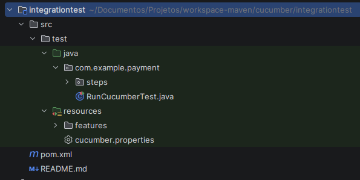

# 🚀 Testes E2E com Cucumber

---

## 🎯 Objetivo

Testar de forma integrada os endpoints REST da API `lab-a01-app-repository-payment`, com foco em transações PIX. Os testes validam a criação, consulta, atualização, exclusão e listagem de transações, conferindo tanto a persistência no MySQL quanto os retornos de objetos e coleções.

### ✅ Pré-requisitos

- Java 21
- Maven
- Docker

## ⚙️ Cucumber

O projeto usa Cucumber com JUnit Platform para executar os testes de integração como uma suíte. A classe `RunCucumberTest` carrega os arquivos `.feature` em `integrationtest/src/test/resources/features`, aplica o pacote de glue `com.example.payment` e gera relatórios HTML e JSON em `integrationtest/target/cucumber-reports`.

O uso do Cucumber é importante porque:
- permite descrever os testes como cenários legíveis em linguagem natural
- valida os passos dos casos de transação PIX diretamente contra a API REST
- facilita a comunicação entre a equipe técnica e os requisitos de negócio

### 🌱 Projeto gerado com Cucumber

O módulo de testes foi inicialmente criado com o archetype Cucumber:

```shell
mvn archetype:generate \
  "-DarchetypeGroupId=io.cucumber" \
  "-DarchetypeArtifactId=cucumber-archetype" \
  "-DarchetypeVersion=7.31.0" \
  "-DartifactId=integrationtest" \
  "-DgroupId=lab-a01-app-repository-payment" \
  "-Dpackage=com.example.payment" \
  "-Dversion=1.0.0-SNAPSHOT" \
  "-DinteractiveMode=false"
```

O comando acima gera a estrutura básica de pastas e arquivos mostrada na imagem abaixo:



### 📦 Estrutura base de Cucumber

- [/features](integrationtest/src/test/resources/features): contém os arquivos `.feature` que descrevem os cenários de teste em linguagem natural.
- [/steps](integrationtest/src/test/java/com/example/payment/steps): implementa a lógica dos passos Given/When/Then usados pelas features.
- [RunCucumberTest.class](integrationtest/src/test/java/com/example/payment/RunCucumberTest.java): configura a suíte Cucumber, localiza as features e define o pacote de glue.
- [cucumber.properties](integrationtest/src/test/resources/cucumber.properties): ajusta opções de execução e geração de relatórios sem alterar o código.
- [Relatórios](integrationtest/target/cucumber-reports): armazena o resultado da execução em HTML e JSON.


### 📦 Dependências relevantes no `pom.xml`

O arquivo [integrationtest/pom.xml](integrationtest/pom.xml) declara as dependências do Cucumber e do JUnit, além do plugin `maven-surefire-plugin` para rodar a suíte de testes.

```xml
<dependencyManagement>
    <dependencies>
        <dependency>
            <groupId>io.cucumber</groupId>
            <artifactId>cucumber-bom</artifactId>
            <version>7.31.0</version>
            <type>pom</type>
            <scope>import</scope>
        </dependency>
        <dependency>
            <groupId>org.junit</groupId>
            <artifactId>junit-bom</artifactId>
            <version>5.14.0</version>
            <type>pom</type>
            <scope>import</scope>
        </dependency>
    </dependencies>
</dependencyManagement>

<dependencies>
    <dependency>
        <groupId>io.cucumber</groupId>
        <artifactId>cucumber-java</artifactId>
        <scope>test</scope>
    </dependency>
    <dependency>
        <groupId>io.cucumber</groupId>
        <artifactId>cucumber-junit-platform-engine</artifactId>
        <scope>test</scope>
    </dependency>
    <dependency>
        <groupId>org.junit.platform</groupId>
        <artifactId>junit-platform-suite</artifactId>
        <scope>test</scope>
    </dependency>
</dependencies>
```

### 🧪 RunCucumberTest.class - Classe de execução do Cucumber

O projeto utiliza Cucumber com JUnit Platform via a suíte [RunCucumberTest](integrationtest/src/test/java/com/example/payment/RunCucumberTest.java). A classe:
- localiza os arquivos `.feature` em `integrationtest/src/test/resources/features`
- define o pacote de glue `com.example.payment`
- habilita a execução dos passos em `integrationtest/src/test/java/com/example/payment/steps`
- gera relatórios HTML e JSON em `integrationtest/target/cucumber-reports`

```java
package com.example.payment;

import org.junit.platform.suite.api.ConfigurationParameter;
import org.junit.platform.suite.api.ConfigurationParametersResource;
import org.junit.platform.suite.api.IncludeEngines;
import org.junit.platform.suite.api.SelectClasspathResource;
import org.junit.platform.suite.api.Suite;

import static io.cucumber.junit.platform.engine.Constants.GLUE_PROPERTY_NAME;
import static io.cucumber.junit.platform.engine.Constants.PLUGIN_PROPERTY_NAME;

@Suite
@IncludeEngines("cucumber")
@SelectClasspathResource("features")
@ConfigurationParameter(key = PLUGIN_PROPERTY_NAME, value = "pretty, " +
        "html:target/cucumber-reports/cucumber-report.html, " +
        "json:target/cucumber-reports/cucumber.json")
@ConfigurationParameter(key = GLUE_PROPERTY_NAME, value = "com.example.payment")
@ConfigurationParametersResource("cucumber.properties")
public class RunCucumberTest {
}
```
---

## ✨ Customizando o projeto de teste
Este projeto parte de um módulo base Cucumber e foi adaptado para executar os testes E2E específicos da API REST de transações PIX. A customização inclui:
- ajuste dos `steps` para chamar a API via REST;
- inclusão de `builders` , `commons`, `loaders`, `dtos` e clientes HTTP com `RestAssured` para suportar os cenários de teste;
- configuração de relatórios e parâmetros de execução para a suíte de integração.

### 🧩 Organização das pastas

A estrutura principal do projeto de testes está em [integrationtest/src/test](integrationtest/src/test) e está organozado da seguinte forma:

```text
com/example/payment/
├── RunCucumberTest.java
├── builder/
│   ├── TransacaoPixRequestDTOTestDataBuilder.java
│   └── TransacaoPixUpdateRequestDTOTestDataBuilder.java
├── common/
│   └── RestClient.java
├── converter/
│   └── DocStringTypeConverter.java
├── loader/
│   └── TransacaoPixTestDataClient.java
├── scenario/
│   ├── TransacaoPixPostScenario.java
│   ├── TransacaoPixGetScenario.java
│   ├── TransacaoPixPutScenario.java
│   ├── TransacaoPixDeleteScenario.java
│   ├── TransacaoPixQueryScenario.java
│   └── dto/
│       ├── TransacaoPixRequestDTO.java
│       └── TransacaoPixUpdateRequestDTO.java
└── steps/
    ├── TransacaoPixPostStepdefs.java
    ├── TransacaoPixGetStepdefs.java
    ├── TransacaoPixPutStepdefs.java
    ├── TransacaoPixDeleteStepdefs.java
    └── TransacaoPixQueryStepdefs.java

resources/
├── cucumber.properties
└── features/
    ├── TransacaoPixDelete.feature
    ├── TransacaoPixGet.feature
    ├── TransacaoPixPost.feature
    ├── TransacaoPixPut.feature
    └── TransacaoPixQuery.feature
```

### 📁 O que cada pasta faz

- `RunCucumberTest.java`: entrada da suíte Cucumber (JUnit Platform). Configura onde buscar `features`, define o `glue` (`com.example.payment`) e ativa plugins de relatório (HTML/JSON).
- `builder/`: *test data builders* que constroem objetos de requisição e respostas usadas nos cenários (padrão fluente para facilitar arranjos de teste).
- `common/`: utilitários e clientes compartilhados, por exemplo `RestClient` que centraliza chamadas HTTP, autenticação e tratamento de respostas.
- `converter/`: conversores customizados usados pelo Cucumber (ex.: `DocStringTypeConverter`) para transformar DocStrings/parametros em objetos Java.
- `loader/`: classes responsáveis por carregar ou preparar dados de teste externos (fixtures, clientes de teste, inserções via API/DB).
- `scenario/`: implementações de cenários de alto nível e fluxos reutilizáveis; `scenario/dto` contém DTOs auxiliares usados pelas features e steps.
- `steps/`: classes com as implementações dos passos Given/When/Then que traduzem as linhas Gherkin em chamadas de teste.
- `resources/`: arquivos de configuração (`cucumber.properties`) e as `features/*.feature` que descrevem os cenários em Gherkin.
- `target/` (gerado): saída de compilação e relatórios — confira `target/cucumber-reports` após a execução dos testes.

### 🧩 Organização de um Steps Definition
No Cucumber, as `Step Definitions` fazem a ponte entre a linguagem natural das features e a implementação de teste em Java.

- Um arquivo `.feature` descreve o comportamento esperado usando `Given`, `When`, `Then` e `And`.
- A classe `Stepdefs` mapeia esses passos para métodos anotados com `@Given`, `@When` e `@Then`.
- O pacote `glue` configurado em `RunCucumberTest` informa ao Cucumber onde buscar essas classes.
- Cada passo pode executar chamadas HTTP, preparar dados, validar respostas e manter o estado do cenário.

```text
Feature file (Gherkin)  ->  Step Definition  ->  Scenario implementation
```

#### 1) Feature em Gherkin

A feature `TransacaoPixGet.feature` define o fluxo de consulta da transação Pix e os resultados esperados:

```gherkin
@TransacaoPixGet
Feature: Obter um registro de PIX

  Scenario: Buscar transação Pix existente com sucesso
    Given que existe uma nova transação Pix cadastrada para consulta
    When eu buscar a transação Pix gerada
    Then o status da resposta deve ser 200
    And o sistema deve retornar os dados da transação Pix gerada com sucesso

  Scenario: Buscar transação Pix inexistente e receber erro
    When eu buscar a transação Pix pelo id "a6e09e0c-c389-416e-bebf-c6893c15002c"
    Then o status da resposta deve ser 404
    And o sistema deve retornar um erro informando que a transação não foi encontrada
```

#### 2) Step Definition

Em `TransacaoPixGetStepdefs.java`, cada frase Gherkin é vinculada a um método Java que executa a ação correspondente e realiza asserções.

```java
package com.example.payment.steps;

import com.example.payment.scenario.TransacaoPixGetScenario;
import com.fasterxml.jackson.databind.JsonNode;
import io.cucumber.java.After;
import io.cucumber.java.Before;
import io.cucumber.java.en.Given;
import io.cucumber.java.en.Then;
import io.cucumber.java.en.When;

import static org.assertj.core.api.Assertions.assertThat;

public class TransacaoPixGetStepdefs {

    private TransacaoPixGetScenario pixGetScenario;

    @Before
    public void init() {
        pixGetScenario = new TransacaoPixGetScenario();
    }

    @Given("que existe uma nova transação Pix cadastrada para consulta")
    public void queExisteUmaNovaTransacaoPixCadastradaParaConsulta() {
        pixGetScenario.prepararTransacaoPixExistente();
    }

    @When("eu buscar a transação Pix gerada")
    public void euBuscarATransacaoPixGerada() {
        pixGetScenario.buscarTransacaoPixGerada();
    }

    @When("eu buscar a transação Pix pelo id {string}")
    public void euBuscarATransacaoPixPeloId(String codigoTransacao) {
        pixGetScenario.buscarTransacaoPixPorId(codigoTransacao);
    }

    @Then("o sistema deve retornar os dados da transação Pix gerada com sucesso")
    public void oSistemaDeveRetornarOsDadosDaTransacaoPixGeradaComSucesso() {
        JsonNode responseDTO = pixGetScenario.getResponse().as(JsonNode.class);

        assertThat(responseDTO.get("codigoTrancacao").asText())
                .isEqualTo(pixGetScenario.getCodigoTransacaoGerado());
    }

    @Then("o status da resposta deve ser {int}")
    public void oStatusDaRespostaDeveSer(int statusCode) {
        pixGetScenario.getResponse()
                .then()
                .assertThat()
                .statusCode(statusCode);
    }

    @Then("o sistema deve retornar um erro informando que a transação não foi encontrada")
    public void oSistemaDeveRetornarUmErroInformandoQueATransacaoNaoFoiEncontrada() {
        JsonNode responseDTO = pixGetScenario.getResponse().as(JsonNode.class);
        assertThat(responseDTO.get("messages")).isNotEmpty();
    }

    @After
    public void tearDown() {
        pixGetScenario.limpar();
    }
}
```

#### 3) Cenário de execução

A classe `TransacaoPixGetScenario.java` encapsula o fluxo de execução do teste, guardando o estado necessário para executar a consulta e validar a resposta. Para cada cenário Cucumber, um novo objeto `TransacaoPixGetScenario` é criado pelo método anotado com `@Before` em `TransacaoPixGetStepdefs.java`, garantindo que cada cenário comece com um estado limpo.

```java
package com.example.payment.scenario;

import com.example.payment.common.RestClient;
import com.example.payment.loader.TransacaoPixTestDataClient;
import com.example.payment.scenario.dto.TransacaoPixRequestDTO;
import io.restassured.response.Response;

public class TransacaoPixGetScenario {

    private static final int SERVER_PORT = 8000;
    private static final String BASE_URI = "http://localhost";
    private static final String ENDPOINT = "/transacao-pix/{id}";

    private final RestClient restClient;
    private final TransacaoPixTestDataClient testDataClient;

    private String codigoTransacaoGerado;

    public TransacaoPixGetScenario() {
        this.restClient = new RestClient(BASE_URI, SERVER_PORT);
        this.testDataClient = new TransacaoPixTestDataClient();
    }

    public void prepararTransacaoPixExistente() {
        this.codigoTransacaoGerado = testDataClient.criarTransacaoPix();
    }

    public void prepararTransacaoPixExistente(TransacaoPixRequestDTO requestDTO) {
        this.codigoTransacaoGerado = testDataClient.criarTransacaoPix(requestDTO);
    }

    public void buscarTransacaoPixGerada() {
        restClient.executeGet(ENDPOINT, codigoTransacaoGerado);
    }

    public void buscarTransacaoPixPorId(String codigoTransacao) {
        restClient.executeGet(ENDPOINT, codigoTransacao);
    }

    public String getCodigoTransacaoGerado() {
        return codigoTransacaoGerado;
    }

    public Response getResponse() {
        return restClient.getResponse();
    }

    public void limpar() {
        restClient.clearRequestData();
    }
}
```

#### 4) Preparação dos dados de teste

A classe `TransacaoPixTestDataClient.java` cria a transação Pix que será usada na validação do GET. Isso garante que o teste tenha um registro válido para consultar.

```java
package com.example.payment.loader;

import com.example.payment.builder.TransacaoPixRequestDTOTestDataBuilder;
import com.example.payment.common.RestClient;
import com.example.payment.scenario.dto.TransacaoPixRequestDTO;

public class TransacaoPixTestDataClient {

    private static final int SERVER_PORT = 8000;
    private static final String BASE_URI = "http://localhost";
    private static final String ENDPOINT = "/transacao-pix";

    private final RestClient restClient;

    public TransacaoPixTestDataClient() {
        this.restClient = new RestClient(BASE_URI, SERVER_PORT);
    }

    public String criarTransacaoPix() {
        var request =
                TransacaoPixRequestDTOTestDataBuilder.builder()
                        .comMensagemTransacao("Teste de massa gerado por cenários")
                        .build();
        return criarTransacaoPix(request);
    }

    public String criarTransacaoPix(TransacaoPixRequestDTO request) {
        restClient.addBody(request);
        restClient.executePost(ENDPOINT);

        var responseBody = restClient.getResponse().asString();
        restClient.clearRequestData();
        return responseBody;
    }
}
```

Esta organização deixa claro como cada camada contribui para o teste: a feature define o comportamento, a Step Definition traduz o passo, a classe de cenário executa a requisição e o loader prepara os dados.


### ▶️ Como executar os testes de integração

Antes de rodar o Cucumber, é preciso subir o ambiente Docker definido em `/docker/docker-compose.yml`.
Esse manifesto sobe a API `lab-a01-app-repository-payment` e, no mesmo stack, um container MySQL onde a API persiste os dados de teste. O mysql já sobe algumas massas pré-carregados principalmente para os testes que são GET.

```bash
cd docker
docker compose up -d
```

Depois que a API e o banco estiverem prontos, execute os testes Cucumber no módulo `integrationtest`:

```bash
mvn -f integrationtest/pom.xml test
```

Se quiser executar apenas uma feature marcada por tag, use:
- @TransacaoPixGet
- @TransacaoPixPost
- @TransacaoPixPut
- @TransacaoPixQuery

Exemplo:

```bash
mvn -f integrationtest/pom.xml test -Dcucumber.filter.tags="@TransacaoPixGet"
```

Os relatórios HTML e JSON são gerados em `integrationtest/target/cucumber-reports`.

### ✨ Personalizações e dicas

- Para alterar o local das `features` ou do `glue`, atualize `RunCucumberTest`.
- Use `integrationtest/src/test/resources/cucumber.properties` para sobrescrever opções do Cucumber, por exemplo:
  - `cucumber.publish.enabled=false`
  - `cucumber.execution.parallel.enabled=true`

---
Arquivo gerado automaticamente: resumo dos casos Cucumber e instruções de configuração.

## Referências

### Cucumber Docs
- [Cucumber io](https://cucumber.io/)
- [Cucumber Documents](https://cucumber.io/docs/cucumber/)
- [Create an empty Cucumber project](https://cucumber.io/docs/guides/10-minute-tutorial/#create-an-empty-cucumber-project)

### GitHub Docs
- [Cucumber](https://github.com/cucumber)
- [Cucumber Java](https://github.com/cucumber/cucumber-jvm/tree/main/cucumber-java)
- [Cucumber Spring](https://github.com/cucumber/cucumber-jvm/tree/main/cucumber-spring)
- [Cucumber JUnit Platform Engine](https://github.com/cucumber/cucumber-jvm/tree/main/cucumber-junit-platform-engine)
- [Cucumber Database](https://github.com/cucumber/cucumber-jvm/tree/main/datatable)
- [Cucumber Expressions](https://github.com/cucumber/cucumber-expressions#readme)
- [Sharing State](https://github.com/cucumber/cucumber-jvm/tree/main/cucumber-spring#sharing-state)
- [Languages](https://cucumber.io/docs/gherkin/languages/)
- [Release Notes](https://github.com/cucumber/cucumber-jvm/tree/main/release-notes)
